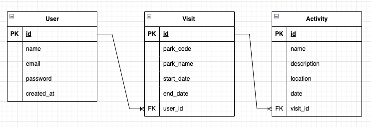

# Capstone 1 proposal - Parktrippers

## Application goal

Parktrippers will allow users to plan their itinerary for a trip to a US national park. This app will allow users to browse what events and activities are available during their stay, and add them to a daily or multi-day itinerary.

## Target audience

The target audience is anyone planning to visit a US national park.

## API

NPS API: https://www.nps.gov/subjects/developer/api-documentation.htm. This API includes all information needed for a successful park visit including park details, campgrounds, events, activities, hiking trails, visitor centers, etc.

## Database schema

## What kinds of issues might you run into with your API?

Time-sensitive data (such as events) may be incorrect if there are last-minute updates or cancellations.

## Is there any sensitive information you need to secure?

User passwords and other sensitive user information

## What functionality will your app include?

- Users can sign up and log in
- Users can create 'visits' which are associated with a park and time-bound
- Users can view all available activities for that park in that time frame and check the ones they want to attend to add to the visit. Regularly available activities (e.g. campground, hiking trails, ranger programs) can also be added to the visit.
- Custom information can also be added to a visit, such as notes, food options, grocery list, car information
- Users can view a list of all of their visits, and view the details of specific visit
- Users can update and delete their visits

## User flow

1. Authentication
   1. **Signup flow:** Sign up for an account with name, email, password
   2. **Login flow:** Log in to an account using email and password
2. Create a new visit record
   1. Select the park, date range for the visit, and other info (e.g. # of people in the group )
   2. UI will populate with all available campgrounds, trails, events, and ranger programs, based on selected park and date range
   3. Activities can be checked to be associated with user visit
   4. User visit is saved
3. View the detail page of a visit, update or delete the visit

## Stretch goals

1. Include GPS coordinates for events/campgrounds/trailheads so that users can click and open up locations on a map.
2. Make mobile friendly.
3. Add warnings of weather, trail danger, and event cancellations on the home page
